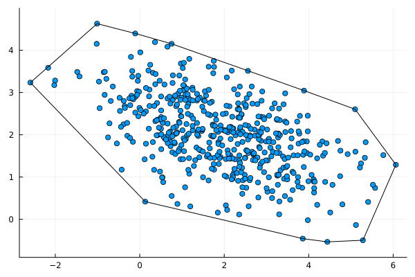
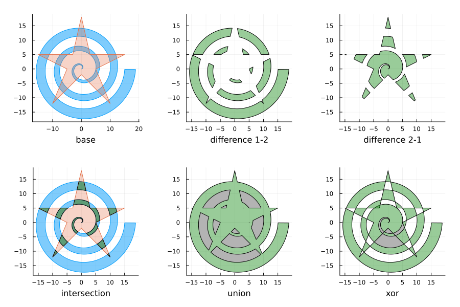

# Polygon Algorithms

Implementations of Polygon algorithms.

<p align="center">
  
   
</p>

## Description
### Representation

Points are represented as tuples and polygons as list of points (tuples).
The last point is assumed to share an edge with the first: `n + 1 = 1`.

For indexing use `x_coords` and `y_coords`. 
Common broadcasting operations are supplied such as `translate` and `rotate`.

An alternative representation for polygons is as 2&times;N matrices. 
This form is more natural for indexing and broadcasting operations such as translation and rotation.
Otherwise the algorithms here do not make use of matrix operations. 
For example, inverting a matrix has no meaning.

To convert between the forms, use `matrix_to_points` or `points_to_matrix`.

### Example

```julia
using PolygonAlgorithms
using PolygonAlgorithms: x_coords, y_coords

poly = [
    (0.4, 0.5), (0.7, 2.0), (5.3, 1.4), (4.0, -0.6)
]
area_polygon(poly) # 7.855
contains(poly, (2.0, 0.5)) # true
contains(poly, (10.0, 10.0)) # false

poly2 = [
    (3.0, 3.0), (4.0, 1.0), (3.0, 0.5), (2.0, -0.5), (1.5, 0.9)
]
intersection = intersect_geometry(poly, poly2)

using Plots
idxs = vcat(1:length(poly), 1)
plot(x_coords(poly, idxs), y_coords(poly, idxs))
```

## Algorithms

For all of the the following `n` and `m` are the number of vertices of the polygons.

1. Area of polygon and centroid of polygon. 
    - Shoe-lace formula.
    - Time complexity: `O(n)`. 
    - Reference: [Wikipedia](https://en.wikipedia.org/wiki/Polygon#Area).
2. Point in polygon.
    - Ray casting with an extension from the following paper: "A Simple and Correct Even-Odd Algorithm for the Point-in-Polygon Problem for Complex Polygons" by Michael Galetzka and Patrick Glauner (2017).
    - Time complexity: `O(n)`. 
    - Reference: [Wikipedia](https://en.wikipedia.org/wiki/Point_in_polygon), [paper](https://arxiv.org/abs/1207.3502).
3. Convex hull.
    - Gift-wrapping algorithm:
        - Time complexity: `O(nh)` where `h` is the number of points in the hull.
        - Reference: [Wikipedia](https://en.wikipedia.org/wiki/Gift_wrapping_algorithm).
    - Graham Scan algorithm:
        - Time complexity: `O(n*log(n))`.
4. Intersection of polygons (polygon clipping). 
    - Chasing edges algorithm:
        - Convex only.
        - From "A New Linear Algorithm for Intersecting Convex Polygons" (1981) by Joseph O'Rourke et. al.
        - Time complexity: `O(n+m)`.
        - Reference: https://www.cs.jhu.edu/~misha/Spring16/ORourke82.pdf
    - Point search algorithm:
        - Convex only.
        - Combines point in polygon algorithm with intersection of edges.
        - Time complexity: `O(nm)`.
        - For general non-self-intersecting polygons, the intersection points are valid but the order is not.
    - Weiler-Atherton algorithm:
        - Concave and convex but not self-intersecting.
        - Time complexity: `O(nm)`. 
        - For a full explanation, see my [blog post](https://liorsinai.github.io/mathematics/2023/09/30/polygon-clipping.html).

## Installation

Download the GitHub repository (it is not registered). Then in the Julia REPL:
```
julia> ] #enter package mode
(@v1.x) pkg> dev path\\to\\PolygonAlgorithms
julia> using Revise # allows dynamic edits to code
julia> using PolygonAlgorithms
```

Optionally, tests can be run with:
```
(@v1.x) pkg> test PolygonAlgorithms
```

## Related

- [PolygonOps](https://github.com/JuliaGeometry/PolygonOps.jl)
- [PolygonClipping](https://github.com/JuliaGeometry/PolygonClipping.jl)