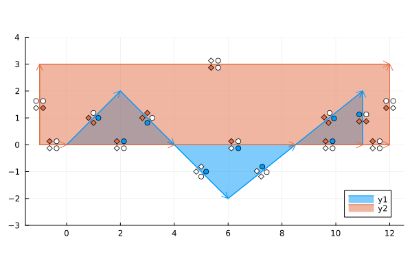

# Polygon Algorithms

Implementations of Polygon algorithms.

<p align="center">
  
   
</p>

## Description
### Representation

There are several ways to represent polygons:
- As a list of points (tuples). The last point is assumed to share an edge with the first: `n + 1 = 1`.
- With the internal `PolygonAlgorithms.Polygon` struct. This struct consists of an `exterior` and `holes`. Each sub-object must be a list of points (tuples). The holes should be properly contained in the polygon.
Validation is not performed by default. Pass `validate=true` to the constructor to enable it.
- As a list of segments. This representation naturally allows multi-polygons and holes. 
It is used internally for some algorithms including the `martinez_rueda_algorithm`.

For indexing use `x_coords` and `y_coords`. 
Common broadcasting operations are supplied such as `translate` and `rotate`.

An alternative representation for polygons is as 2&times;N matrices. 
This is not used here, but can be more efficient for indexing and broadcasting operations such as translation and rotation.
To convert to this representation and back, use `matrix_to_points` or `points_to_matrix`.

### Example

```julia
using PolygonAlgorithms
using PolygonAlgorithms: x_coords, y_coords

poly = [
    (0.4, 0.5), (0.7, 2.0), (5.3, 1.4), (4.0, -0.6)
]
area_polygon(poly) # 7.855
contains(poly, (2.0, 0.5)) # true
contains(poly, (10.0, 10.0)) # false

poly2 = [
    (3.0, 3.0), (4.0, 1.0), (3.0, 0.5), (2.0, -0.5), (1.5, 0.9)
]
intersection = intersect_geometry(poly, poly2)

using Plots
idxs = vcat(1:length(poly), 1)
plot(x_coords(poly, idxs), y_coords(poly, idxs))
```

## Polygon Functions

For all of the the following `n` and `m` are the number of vertices of the polygons.

1. `area_polygon`, `centroid_polygon`, `first_moment`, `is_clockwise`, `is_counter_clockwise`
    - Operations: area of polygon, centroid of polygon, polygon direction.
    - Algorithm: Shoe-lace formula.
    - Time complexity: `O(n)`.
    - Reference: [Wikipedia](https://en.wikipedia.org/wiki/Polygon#Area).
2. `bounds`
    - Operation: bounding rectangle of a polygon.
    - Algorithm: linear serach.
    - Time complexity: `O(n)`.
3. `contains`
    - Operation: point in polygon.
    - Algorithm: Ray casting with an extension from the following paper: "A Simple and Correct Even-Odd Algorithm for the Point-in-Polygon Problem for Complex Polygons" by Michael Galetzka and Patrick Glauner (2017).
    - Time complexity: `O(n)`. 
    - Reference: [Wikipedia](https://en.wikipedia.org/wiki/Point_in_polygon), [paper](https://arxiv.org/abs/1207.3502).
4. `convex_hull`
    - Operation: minimum convex hull around a set of points.
    - Gift-wrapping algorithm:
        - Time complexity: `O(nh)` where `h` is the number of points in the hull.
        - Reference: [Wikipedia](https://en.wikipedia.org/wiki/Gift_wrapping_algorithm).
    - Graham Scan algorithm:
        - Time complexity: `O(n*log(n))`.
5. `intersect_convex`
    - Operation: intersection of convex polygons (polygon clipping). 
    - Chasing edges algorithm (default):
        - Convex only.
        - From "A New Linear Algorithm for Intersecting Convex Polygons" (1981) by Joseph O'Rourke et. al.
        - Time complexity: `O(n+m)`.
        - Reference: https://www.cs.jhu.edu/~misha/Spring16/ORourke82.pdf
    -  Point search algorithm:
        - Convex only.
        - Combines point in polygon algorithm with intersection of edges.
        - Time complexity: `O(nm)`.
        - For general non-self-intersecting polygons, the intersection points are valid but the order is not.
    - Martinez-Rueda algorithm (default):
        - See point 7.
    - Weiler-Atherton algorithm:
        - See point 6.
6. `intersect_geometry`
    - Operation: Intersection of polygons (polygon clipping).
    - Martinez-Rueda algorithm (default).
        - See point 7.
    - Weiler-Atherton algorithm:
        - Concave and convex but not self-intersecting.
        - Time complexity: `O(nm)`. 
        - For a full explanation, see my [blog post](https://liorsinai.github.io/mathematics/2023/09/30/polygon-clipping.html).
7. `difference_geometry`, `intersect_geometry`, `union_geometry`, `xor_geometry`
    - Operation: boolean operations on polygons.
    - Algorithm: Martinez-Rueda.
    - Concave, convex and self-intersecting with holes. Can operate on multiple polygons at once.
    - Annotates each segments with 4 fill criteria: filled by itself above and/or below, and filled by the other polygon above and/or below. Once this has been accomplished, it is trivial to select segments which match the given operation. These segments are then combined to form the final polygon.
    - Time complexity: `O((n+m+k)log(n+m))`. 
    - Reference: https://www.researchgate.net/publication/220163820_A_new_algorithm_for_computing_Boolean_operations_on_polygons
    - Blog post: https://sean.fun/a/polygon-clipping-pt2/
    <p align="center">
    
   </p>

## Robustness

Mathematically, the algorithms are infinitely precise.
Practically, this code works with floats that require a tolerance threshold.
The philosophy of this package is to define tolerances that can be passed down as keyword arguments throughout the entire algorithm.
The two main tolerances are the absolute tolerance `atol` and the relative tolerance `rtol`. 
They take the default values of `PolygonAlgorithms.default_atol` and `PolygonAlgorithms.default_rtol` respectively which are both set to `1e-6`.

Several core functions make use of `atol` including:
- `PolygonAlgorithms.is_same_point`: two points are the same if the straight line distance separating them is less than `atol`.
- `PolygonAlgorithms.get_orientation`: three points are colinear if the [cross product](https://mathworld.wolfram.com/CrossProduct.html) is less than `atol`.
- `PolygonAlgorithms.intersect_geometry`: for the line method, two lines are considered parallel if the absolute value of the determinant of the intersection matrix is less than `atol`.

Some functions make use of `rtol` including:
= `PolygonAlgorithms.intersect_geometry`: for the segment method, an intersection is considered valid even if the segments intersect a proportion `rtol` outside of the line length.

The behaviour of this code is not fully controlled under the tolerance.
It is strongly recommend to work with lines and points that are much further apart than the tolerance.
Otherwise, errors may arise in the output.

Note: there is also a defunct `rtol` value that is current not used.

## Installation

In the Julia REPL:
```
julia> ] #enter package mode
(@v1.x) pkg> add PolygonAlgorithms
julia> using PolygonAlgorithms
```

Optionally, tests can be run with:
```
(@v1.x) pkg> test PolygonAlgorithms
```

## Related

- [PolygonOps](https://github.com/JuliaGeometry/PolygonOps.jl)
- [PolygonClipping](https://github.com/JuliaGeometry/PolygonClipping.jl)